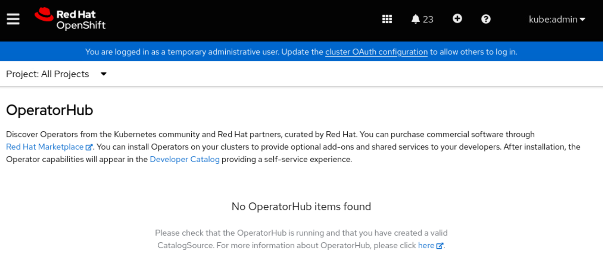
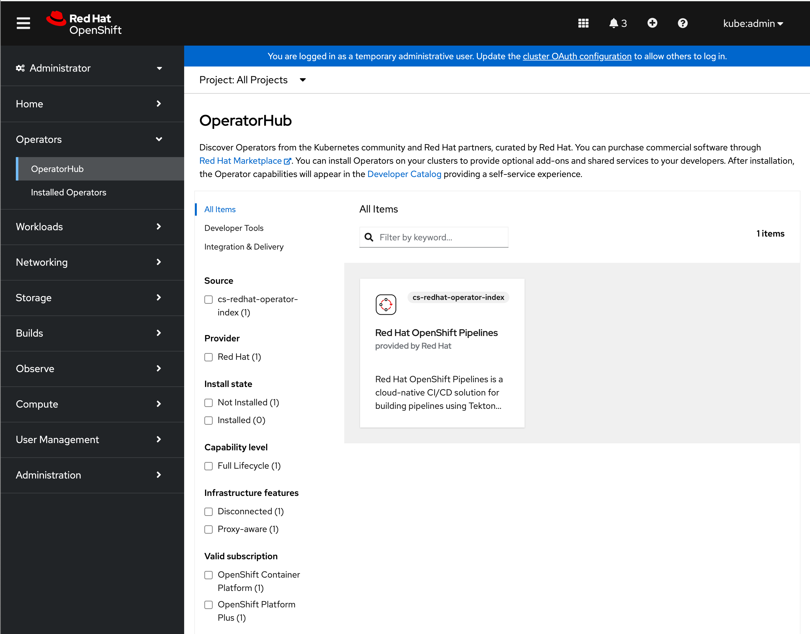

## Create the catalog sources to access the RedHat Marketplace operators

The OpenShift cluster does not have internet access. Therefore the operator catalog for available operators has to be configured to point to the image mirrored to the Quay private image registry installed on the offline bastion.

To do this, we will use the `catalogSource-redhat-operator-index.yaml` file previously created during installation and available in `/root/oc-mirror-workspace/results-XXXXXX`.

Before applying the catalog source, the default catalogs that have been installed with Openshift cluster need to be deactivated:

```{ .text .copy title="[root@bastion ~]"}
oc patch OperatorHub cluster --type json -p '[{"op": "add", "path": "/spec/disableAllDefaultSources", "value": true}]'
```

```{ .text .no-copy title="Output"}
operatorhub.config.openshift.io/cluster patched
```

We should see no operator available in the OperatorHub of our OpenShift cluster:

{: style="max-height:400px"}

Now, to create that custom catalog source that points to our Quay private image registry, execute the following commands:

```{ .text .copy title="[root@bastion ~]"}
cd /root/oc-mirror-workspace/results-XXXXX/
```

```{ .text .copy title="[root@bastion results-XXXXX]"}
oc apply -f catalogSource-cs-redhat-operator-index.yaml
```

```{ .text .no-copy title="Output"}
catalogsource.operators.coreos.com/redhat-operator-index created
```

Check now if the operators are listed:

{: style="max-height:900px"}

## Deactivate the cluster update channel

Openshift defines an update channel to search for and install updates. Since this cluster does not have any internet access, it is recommended to turn off the update channel.

Run the following command to modify the update channel and set it to null, leaving the cluster without an update channel.

```{ .text .copy title="[root@bastion transfer-files]"}
oc adm upgrade channel --allow-explicit-channel
```

```{ .text .no-copy title="Output"}
warning: Clearing channel "stable-4.16"; cluster will no longer request available update recommendations.
```
