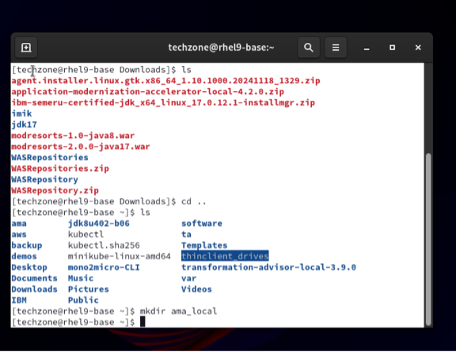
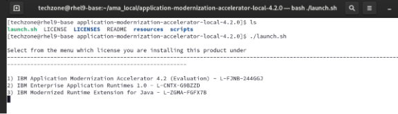
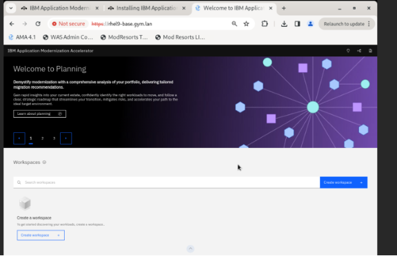
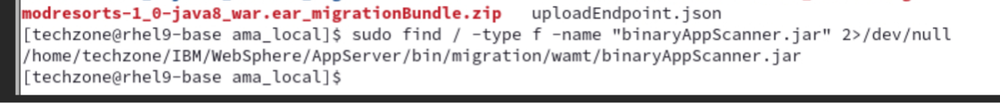

# Install AMA

## Install AMA

A complete set of instructions for all supported platforms can be found in [the AMA page from IBM Documentation](https://www.ibm.com/docs/en/ama?topic=install){target="_blank"}.  You can run the tool within your TechZone environment that you deployed or within Podman on your local system.

!!! Tip "Podman"
    What you don't already have **Podman** available on your laptop?  No worries, [follow these instructions to download and install](https://podman-desktop.io/downloads){target="_blank"}

If you haven't already, go to the [Registration and download site](https://www.ibm.com/account/reg/us-en/signup?formid=urx-53705){target="_blank"} and download the Application Modernization Accelerator Local install script.

Create a directory for the Application Modernization Accelerator files, for example, `ama_local`. Copy the .zip file that you downloaded during the registration step into this directory and extract it.



Run the following command: `./launch`
- Select 1 if you agree with the terms of the License.
- Select 1 to install Application Modernization Accelerator



After the installation is complete, you can access Application Modernization Accelerator locally at the following URLs. The host name or IP address and port are provided by the installation program.

- Linux: https://< host name >:443
- MacOS: https://< IP Address >:443



You Should now have a local host with AMA now running on your machine 

!!! Note "Ports"
    For Application Modernization Accelerator to function correctly your system must be configured to allow ingress and egress on ports 3000 & 2220

## Binary Scanner

Locate the tools and the binary scanner:

```bash
sudo find / -type f -name "binaryAppScanner.jar" 2>/dev/null
```

{width=75%}

Next, verify the AMA CLI (Transformation Advisor CLI):

```bash
~/ama_local/transformationadvisor-4.x/bin/transformationadvisor --help
```


