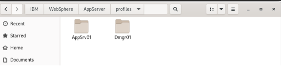
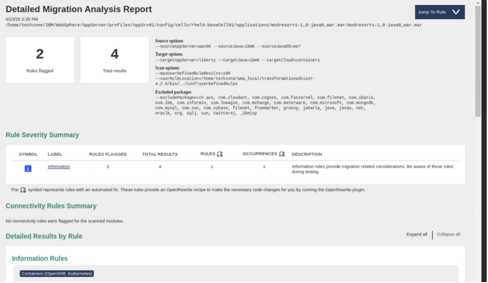

# Running the AMA Scan

## Generate Migration Artifacts

Locate the Application(s) and scan live running EAR / WAR files.  Each environment may have them housed under a different directory / folder.

The example below shows the location of two application server profiles on the demo environment:

{width=75%}

Invoke the discovery portion of AMA (Transformation Advisor):

```bash
./transformationadvisor \
  -w /home/techzone/IBM/WebSphere/AppServer \
  -p AppSrv01
```

!!! Tip "Explaining the Command"
    -w <was-install-root>
    Points at your WebSphere Traditional install directory (the folder containing profiles/, bin/, etc.).
    
    -p <profileName>
    Tells it which profile under profiles/ to inspect (in our case, AppSrv01).
    
    Default “collect” action and with no further flags, transformationadvisor will:
    
    - Gather all of the server configuration under that profile (cells, nodes, resources, applications).
    - Bundle up any deployed EARs/WARs it finds in the profile’s applications/ tree.
    - Zip everything into a migrationBundle.zip in the output directory you specify (defaults to a local temp if you don’t override).
    
## Result

You end up with a single bundle that you can either:

- Upload into the AMA UI to get the web-based analysis and container recipes, or
- Unzip locally to see raw JSON, XML, and the deployed archives.

It does not perform the Java-8→Java-21 or WAS→Liberty code scans—that’s what the separate binaryAppScanner.jar does when you run it against an EAR/WAR with --all/--ta/--generateConfig flags. This “collect” step simply builds the input bundle for the UI or for later analysis.

The following is an example of the  Migration Analysis report from the resulting scan:



## Binary Application Scanner

Run the binary application scanner:

```bash
java -jar /home/techzone/IBM/WebSphere/AppServer/bin/migration/wamt/binaryAppScanner.jar \
/home/techzone/IBM/WebSphere/AppServer/profiles/AppSrv01/config/cells/\
rhel9-baseCell01/applications/modresorts-1_0-java8_war.ear \
--all \
--sourceAppServer=was90 \
--sourceJava=ibm8 \
--targetAppServer=liberty \
--targetJava=java21 \
--targetCloud=containers \
--output=/home/techzone/ama-output/modresorts-liberty-java21
```

!!! Tip "Explaining the Command"
    - `java -jar …/binaryAppScanner.jar` You’re launching the Migration Toolkit for Application Binaries’ scanner tool. This JAR contains the logic to inspect Java EE archives and produce:

        - An Application Migration Report (inventory, detailed analysis, technology evaluation)
        - OpenRewrite recipes for code refactoring
        - Configuration recipes for target servers
        -Containerization artifacts (Dockerfile + Kubernetes YAML)
     
    - Positional argument: your .ear path `/home/techzone/IBM/WebSphere/AppServer/profiles/AppSrv01/config/cells/rhel9-baseCell01/applications/modresorts-1_0-java8_war.ear`. This tells the scanner exactly which binary to examine. It will:
        - Unpack the EAR
        - Read its bytecode to analyze API usage
        - Look up any matching server-side configuration under the same profile (for features, resources, etc.)
     
    -  `--all (Action)` This single flag instructs the tool to run every built-in report in one pass:
        - Inventory (what’s in the archive?)
        - Technology Evaluation (what programming models are used?)
        - Detailed Migration Analysis (what rules get flagged?)
        - Configuration (what server.xml or wsadmin scripts to generate?)
        - Using --all is the easiest way to get the full migration bundle.
     
    - Source flags
        - `--sourceAppServer=was90` Indicates your application currently runs on WebSphere Application Server 9.0. The scanner will apply WAS-specific rules and know how to locate any deployed-server artifacts.
        - `--sourceJava=ibm8` Tells it “the code is compiled for IBM Java 8,” so it can detect deprecated or removed APIs.
     
    - Target flags
        - `--targetAppServer=liberty` You want the recommendations and configuration snippets targeted at Liberty, not a traditional WAS profile.
        - `--targetJava=java21` You’re migrating your code to run on Java 21, so the tool will surface any Java–8→21 incompatibilities and generate OpenRewrite recipes to fix them.
        - `--targetCloud=containers` Ask the scanner to include containerization recipes—it will drop in a Dockerfile and Kubernetes YAML under a containerization/ folder in your output.
     
    - `--output=…` Specifies the directory where all of the scanner’s outputs will go. In this case: `/home/techzone/ama-output/modresorts-liberty-java21/` You’ll find:
        - A modresorts-…_migrationBundle.zip with JSON/XML and the raw EAR
        - modresorts-…_MigrationReport.html (the human-readable analysis)
        - server.xml pre-populated with the Liberty features your app needs
        - Possibly sensitivedata.xml and mimetypes.xml (inventory/config snippets)
        - A containerization/ folder containing your Dockerfile and Kubernetes YAML

We have successfully invoked two complementary scans.  Lets go over what we have completed and summarize the steps and commands in the next section.
    

