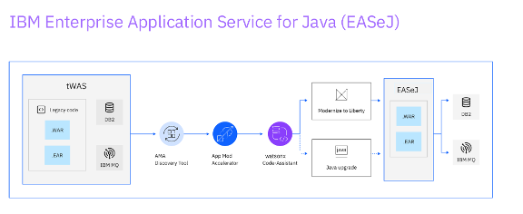
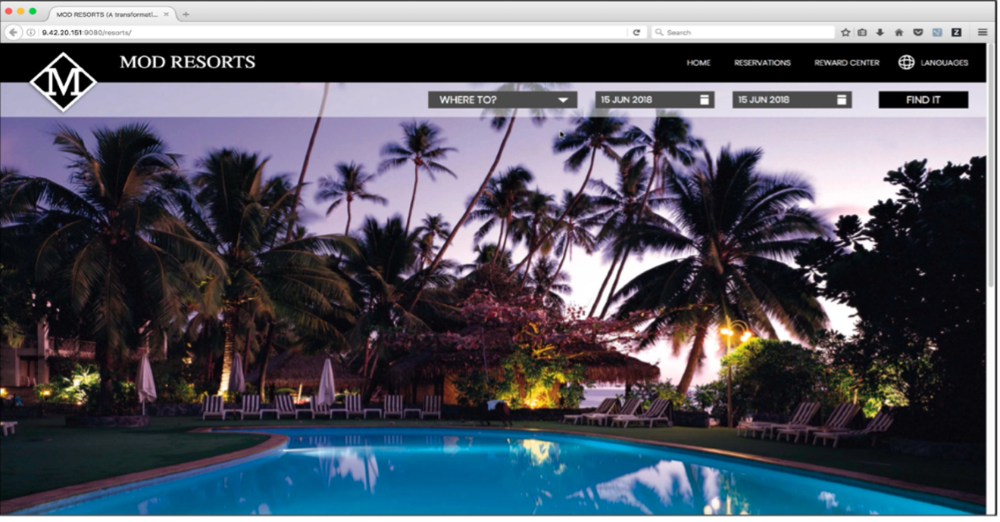

# Application Modernization with AMA

## Prerequisites

The procedure within this exercise is based upon an IBM TechZone environment & Demo.  Deploy the below environment(s) that you will use during this exercise using the below links:

- [Demo Environment Setup Guide - CP4Apps - L3 - Demo - Guidance](https://ibm.github.io/CP4Apps-L3-Demo-Guidance/Transformation%20Advisor/01%20Environment%20Setup%20Guide/){target="_blank"}
- [Modernize WebSphere apps to Liberty using watsonx code assistant - PoT & MoRE / AMA demo environment - 1Q25 release](https://techzone.ibm.com/collection/modernize-web-sphere-apps-to-liberty-using-watsonx-code-assistant-po-t--mo-re--ama-demo-environment-1q25-release){target="_blank"}

This demo provides fundamental hands-on experience with modernizing existing Java applications to WebSphere Liberty, deployed into a container platform, such as Red Hat OpenShift.  The focus of this document is on the practical aspects of how to use the deployment artifacts created by AMA / TA  to speed up the process to deploy a Java app to Liberty running on OpenShift to achieve the objective for operation modernization.

!!! Note "Note on TA and AMA"
    Application Modernization Assistance (AMA) is the next generation of Transformation Advisor (TA).  AMA is provided as part of the EAR JSphere Suite offering.  TA has been widely available for many years and most recently as part of Cloud Pak for Applications.

## Overview

### Liberty

Liberty is an application server designed for the cloud. It’s small, lightweight, and designed with modern cloud-native application development in mind.  It supports the full MicroProfile and Jakarta EE APIs and is composable, meaning that you can use only the features that you need, keeping the server lightweight, which is great for microservices.  It also deploys to every major cloud platform, including Docker, Kubernetes, and Cloud Foundry.

!!! Note "Liberty"
    WebSphere Liberty is include in the JSphere Suite specifically as part of the Enterprise Application Runtimes (EAR) offerings. (As well as EASeJ).  Open Liberty is the community addition of this runtime.

### Operational Modernization

Operational Modernization gives an operations team the opportunity to embrace modern operations best practices without putting change requirements on the development team.  The scaling, routing, clustering, high availability, and continuous availability functionality that were previously provided by the application server middleware, can be provided by the hybrid cloud platform (for instance OCP / Kubernetes, K8s service, SaaS offering).

Operational Modernization allows the operations team to run cloud-native and modernized applications in the same environment with the same standardized logging, monitoring, and security frameworks.  The operation modernization solution provided by IBM is to move existing Java applications to Liberty container.

!!! Note "EASeJ"
    
    
    IBM Enterprise Application Service for Java (EASeJ) is a fresh offering from IBM Cloud that bundles many of the tools discussed within this exercise into a seamless cloud SaaS experience.  It is assumed that the steps within this process are being carried out not within this environment, however, understanding the Hybrid Cloud version of modernization with AMA will assist your understanding of EASeJ.

### AMA

The AMA / TA tool provides the following value:

- Identifies the Java EE programming models in the traditional Java application
- Determines the complexity of re-platforming these applications by listing a high-level inventory of the content and structure of each application
- Highlights Java EE programming model and WebSphere API differences between the WebSphere runtime profile types
- Identifies Java EE specification implementation differences that might affect the app
- Generates accelerators for deploying the application to Liberty and containers in a target environment

Additionally, the tool provides a recommendation for the right-fit IBM WebSphere Application Server edition and offers advice, best practices, and potential solutions to assess the ease of moving apps to Liberty or newer versions of WebSphere traditional. It automatically generates a migration bundle with the artifacts you will need to containerize your application running on Liberty and deploy it to OpenShift Cloud Platform, accelerating application migrating to cloud process, minimizing errors and risks and reducing time to market.

### Operators

Operator is the Kubernetes operator and specifically the Liberty operator. Liberty operator is used in the demo to deploy the app running on Liberty to the OpenShift Container Platform (OCP). The value of operators, in general, is that it really simplifies the amount of configuration required to do a deployment via all the YAML files that are typically required in Kubernetes. Additional benefits specifically to the Liberty operator is that it offers the automation of common tasks, like deploying, scaling, getting dumps, including thread dumps, core dumps and heap dumps, and gathering app logs. Another key benefit of the operator is that it provides out-of-the-box security capability, including certificate management integration with OCP and single sign-on delegation.

### Kubernetes Kustomize

Kubernetes Kustomize is a tool that is native to Kubernetes that is available for customizing Kubernetes configuration. The idea is that the base configuration can be reused for deployments across different environments like development, staging, and production. The changes and modifications for different environments are provided as the adjustment snippets for the base configuration override. In this demo the deployment YAML file created by Transformation Advisor uses the Kustomize tool.

### Mod Resorts Application

Mod Resorts app is a WebSphere application showing the weather in various locations. This app is initially developed for WebSphere traditional. In the demo it will be moved to Liberty in a container and deployed to OCP.

{target="_blank"}

