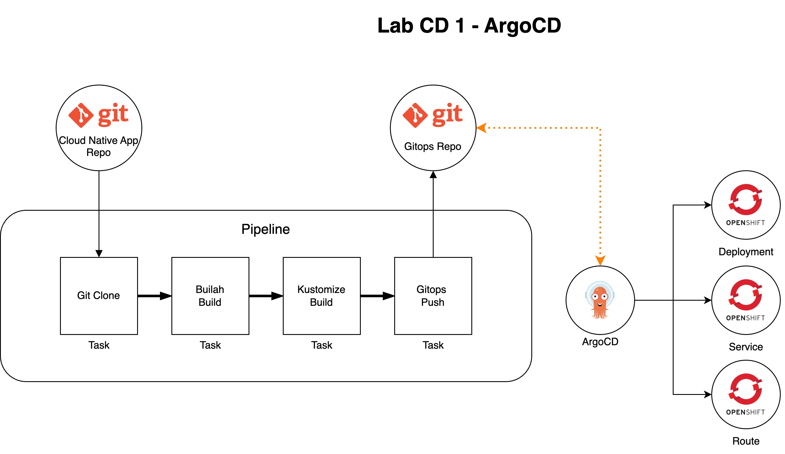
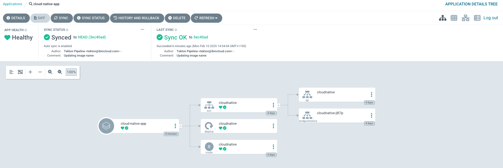

# Deploying an Application to OpenShift

## Description

This workshop covers containerising an application and deploying it to OpenShift both manually and using a CI/CD pipeline with OpenShift-Pipelines (Tekton) and OpenShift GitOps (ArgoCD).

We will be building the following Pipeline to deploy our cloud native application:




1. The pipeline starts by cloning the application source code from a git repository
2. It builds the application image
3. It updates deployment YAML manifests using [kustomize](https://github.com/kubernetes-sigs/kustomize)
4. It pushes updated manifests to a gitops repository
5. [ArgoCD](https://argo-cd.readthedocs.io/en/stable/) then reconciles manifests to OpenShift

## Prerequisites

* Access to the OpenShift cluster Deployed during the OpenShift Install Lab
* ODF installed successfully
* The OpenShift internal registry deployed successfully
* Pipelines Lab completed successfully


!!! note "Copying to clipboard"

    This lab guide uses the `pbcopy` command to reduce mistakes copying to the clipboard. The `pbcopy` command comes by default on MacOS. If you are following the lab on RHEL, you can achieve the same by running these commands: 

    ```bash
    sudo yum install xclip -y 
    ```

    ```bash
    alias pbcopy='xclip -selection clipboard'
    ```


## Guide

## Fork the Cloud Native Application Template

Navigate to the following github repository: https://github.com/platformengineers-xyz/cloud_native_sample_app

1. Select `Use this template`
2. Select `Create a new repository`
3. Make sure to create the application in your personal github space
4. Name your new repository `cloud_native_sample_app`
5. Set visibility to Private
4. Select `Create`

## Configuring SSH Access for Tekton


Generate an SSH key to clone the repository with. We will use this both for the bastion and Tekton:

```bash
ssh-keygen -t ed25519 -N '' -f ~/.ssh/tekton
```

Copy it to your clipboard:
```bash
cat ~/.ssh/tekton.pub | pbcopy
```

## Add the SSH Key to your Repo

1. Navigate to your copy of `cloud_native_sample_app`
2. Select `Settings`
3. Select `Deploy Keys`
4. Select `Add deploy key`
5. Paste in the Tekton key
6. Give the key a title and click `Add Key`

## Set up a Secret to clone from Github Enterprise repo with an SSH key for OpenShift Pipelines


Copy the private key to your clipboard.

```
cat /home/admin/.ssh/tekton | pbcopy
```

Set your namespace:

```bash
NAMESPACE=tekton-demo
```

Add the private key to OpenShift as a Secret in the `tekton-demo` Project:

```bash
MY_HOMEPATH=$(echo ~)
```

```bash
oc create secret generic -n $NAMESPACE github-ssh-key  --from-file=ssh-privatekey=$MY_HOMEPATH/.ssh/tekton --type=kubernetes.io/ssh-auth
```

Annotate the Secret:


```bash
oc annotate secret -n $NAMESPACE github-ssh-key tekton.dev/git-0=github.com
```

Add `known_hosts` to the secret:

```bash
known_hosts_value=$(ssh-keyscan github.com | base64 -w 0) && oc patch secret github-ssh-key --type='json' -p="[{'op': 'add', 'path': '/data/known_hosts', 'value': '${known_hosts_value}'}]"
```

Once complete, your secret should look as follows:

```bash
oc get secret github-ssh-key -n $NAMESPACE -o yaml
```

```YAML
apiVersion: v1
kind: Secret
metadata:
  name: gihthub-ssh-key
  annotations:
    tekton.dev/git-0: github.com
data:
  ssh-privatekey: <private-key>
  known_hosts: <your-known-hosts>
type: kubernetes.io/ssh-auth
```

Add the secret to your Pipeline Service Account:

```
oc secrets link pipeline -n $NAMESPACE github-ssh-key
```

## Install OpenShift GitOps

- Search for the Red Hat Openshift GitOps operator within the OperatorHub.

- Click the install button in the top left hand corner.

- Leave the defaults for the update channel, installation mode, installed namespace and update approval.
  

### Edit The app-build pipeline

!!! note "Prerequisite"
    Make sure you have completed the [Tekton Lab](../tekton/tekton.md) as it is a prerequisite to this section!

Create a GitOps Task:

```YAML

apiVersion: tekton.dev/v1beta1
kind: Task
metadata:
  name: gitops
spec:
  params:
    - name: directory
      type: string
    - name: gitops-repo
      type: string
  steps:
    - args:
        - |-
          echo "Cloning Repo"
          git clone -b main $(params.gitops-repo) gitops 
          git config --global user.email "tekton@ibmcloud.com" 
          git config --global user.name "Tekton Pipeline" 
          cd gitops/
          mkdir -p $(params.directory)
          cp ../k8s/manifests.yaml $(params.directory)/
          git add .
          git commit -m "Updating image name" --allow-empty 
          git push
      command:
        - /bin/bash
        - '-c'
      image: docker.io/csantanapr/helm-kubectl-curl-git-jq-yq
      name: gitops
      resources: {}
      workingDir: $(workspaces.source.path)
  workspaces:
    - name: source
```

Create a `kustomize` task. `kustomize` lets you customize raw, template-free YAML files for multiple purposes. [You can learn more about it here](https://kubectl.docs.kubernetes.io/references/kustomize/):

```YAML
apiVersion: tekton.dev/v1beta1
kind: Task
metadata:
  name: kustomize-build
spec:
  params:
    - description: the name of the app
      name: app-name
      type: string
    - description: namespace that deployment will be tested in
      name: app-namespace
      type: string
    - description: 'contains the full image take in image:tag format'
      name: image-with-tag
      type: string
  steps:
    - image: 'quay.io/upslopeio/kustomize:latest'
      name: kustomize-build
      resources: {}
      script: |
        #!/bin/sh
        set -e
        echo "image-with-tag: $(params.image-with-tag)"
        cd k8s
        kustomize edit set image "*=$(params.image-with-tag)"
        kustomize edit set label "app:$(params.app-name)"
        kustomize edit set label "app.kubernetes.io/instance:$(params.app-name)"
        kustomize edit set label "app.kubernetes.io/name:$(params.app-name)"
        kustomize build > manifests.yaml

        if [ -f manifests.yaml ]; then
          echo "manifests.yaml successfully generated"
          echo "contents of manifests is:"
          cat manifests.yaml
          cp manifests.yaml ../manifests.yaml
        else
          echo "ERROR: manifests.yaml not generated"
          exit 1
        fi
      workingDir: $(workspaces.source.path)
  workspaces:
    - description: contains the cloned git repo
      name: source
```

Update the pipeline to include those tasks:

```YAML
apiVersion: tekton.dev/v1
kind: Pipeline
metadata:
  name: app-build
spec:
  params:
    - description: ssh url for gitops-repo
      name: gitops-repo
      type: string
    - name: source-repo
      type: string
    - name: image_registry
      type: string
    - description: Application name
      name: app-name
      type: string
  tasks:
    - name: clone-repository
      params:
        - name: url
          value: $(params.source-repo)
      taskRef:
        kind: ClusterTask
        name: git-clone
      workspaces:
        - name: output
          workspace: source
    - name: buildah-build
      params:
        - name: IMAGE
          value: $(params.image_registry):$(tasks.clone-repository.results.commit)
        - name: DOCKERFILE
          value: ./Dockerfile
        - name: CONTEXT
          value: .
        - name: STORAGE_DRIVER
          value: vfs
        - name: FORMAT
          value: oci
        - name: BUILD_EXTRA_ARGS
          value: ''
        - name: PUSH_EXTRA_ARGS
          value: ''
        - name: SKIP_PUSH
          value: 'false'
        - name: TLS_VERIFY
          value: 'true'
        - name: VERBOSE
          value: 'false'
      runAfter:
        - clone-repository
      taskRef:
        kind: Task
        name: buildah-build
      workspaces:
        - name: source
          workspace: source
    - name: kustomize-build
      params:
        - name: app-name
          value: $(params.app-name)
        - name: app-namespace
          value: $(context.pipelineRun.namespace)
        - name: image-with-tag
          value: $(params.image_registry):$(tasks.clone-repository.results.commit)
      runAfter:
        - buildah-build
      taskRef:
        kind: Task
        name: kustomize-build
      workspaces:
        - name: source
          workspace: source
    - name: gitops
      params:
        - name: directory
          value: '$(params.app-name)'
        - name: gitops-repo
          value: '$(params.gitops-repo)'
      runAfter:
        - kustomize-build
      taskRef:
        kind: Task
        name: gitops
      workspaces:
        - name: source
          workspace: source
  workspaces:
    - name: source
```

### Run Your Pipeline (CI)

Update the PipelineRun yaml to point to your GitOps and Source repo:

```yaml
apiVersion: tekton.dev/v1beta1
kind: PipelineRun
metadata:
  generateName: app-build-pipeline-
spec:
  serviceAccountName: pipeline
  taskRunSpecs:
    - pipelineTaskName: gitops
      taskServiceAccountName: gitops
  params:
    - name: source-repo
      value: git@github.com:<UPDATE-ME>/cloud_native_sample_app.git
    - name: gitops-repo
      value: git@github.com:<UPDATE-ME>/pe-bootcamp-gitops.git
    - name: image_registry
      value: image-registry.openshift-image-registry.svc:5000/tekton-demo/cloud-native-sample-app
    - name: app-name
      value: cloud-native-app
  pipelineRef:
    name: app-build
  timeout: 1h0m0s
  workspaces:
    - name: source
      volumeClaimTemplate:
        metadata:
          creationTimestamp: null
        spec:
          accessModes:
            - ReadWriteOnce
          resources:
            requests:
              storage: 1Gi
```

Create the PipelineRun:

```bash
oc create -n $NAMESPACE -f pipelinerun.yaml
```

> To monitor the pipeline, head to the console `Pipelines  > Pipelines > pipeline`. The `gitops` task __should__ fail at this stage.

### Enable CD in your application

## Create a Github Repository for your GitOps Resources

GitOps Applications are designed to deploy applications from a git repository. We are now going to create a repository for our Gitops manifests. Navigate to `github.com/<YOUR-USERNAME>?tab=repositories`:

1. Select `New`
2. Name your new repository `pe-bootcamp-gitops`
3. Make sure to create the application in your personal github space
4. Select `Add a README file`. This will make GitHub create a `main` branch for us.
5. Set the repository to `Private`
6. Select `Create`

#### Login to Your Openshift GitOps Instance

On the OpenShift console navigate to the `openshift-gitops` project and open the url in `Networking > Routes > openshift-gitops-server`, or run:

```bash
echo https://$(oc get route -n openshift-gitops openshift-gitops-server -ojsonpath="{.spec.host}")
```

Your username is `admin` and the password can be found in the Secret called `openshift-gitops-cluster` in the `openshift-gitops` namespace

#### Connect Your GitOps repo to OpenShift GitOps


Create an SSH Key with Write access

```bash
ssh-keygen -t ed25519 -a 100 -f ~/.ssh/argo -N ''
```

Copy the private key:

```bash
cat ~/.ssh/argo | pbcopy
```

Back in the Argo UI, navigate to `Settings > Repositories > Connect Repo`:

* Name: `pe-bootcamp-gitops`
* Project: `default`
* Repository URL: `git@github.com:YOUR-USER/pe-bootcamp-gitops.git`
* Paste the SSH key
* Click Connect

Copy your public key:

```
cat ~/.ssh/argo.pub | pbcopy
```

Add the public key as a `Deploy` key to the pe-bootcamp-gitops Github Repo, make sure to check `Allow write access` this time (Setting > Deploy keys)


### Authenticating our Pipeline to work with a GitOps Account

Create a GitOps Service Account to run the GitOps Task.

```bash
oc create -n $NAMESPACE serviceaccount gitops
```

Create a source secret names `gitops-ssh-key` just as you did before for the `github-ssh-key`

```bash
MY_HOMEPATH=$(echo ~)
```

```bash
oc create secret generic -n $NAMESPACE gitops-ssh-key --from-file=ssh-privatekey=$MY_HOMEPATH/.ssh/argo --type=kubernetes.io/ssh-auth
```

Add `known_hosts` to your secret:

```bash
known_hosts_value=$(ssh-keyscan github.com | base64 -w 0) && oc patch secret gitops-ssh-key --type='json' -p="[{'op': 'add', 'path': '/data/known_hosts', 'value': '${known_hosts_value}'}]"
```

Annotate the secret for OpenShift Pipelines:
```bash
oc annotate secret -n $NAMESPACE gitops-ssh-key tekton.dev/git-0=github.com
```

Once complete, the secret should look like this:
```YAML
apiVersion: v1
data:
  ssh-privatekey: <your-key>
  known_hosts: <your-hosts>
kind: Secret
metadata:
  annotations:
    tekton.dev/git-0: github.com
  name: gitops-ssh-key
  namespace: nextjs
type: kubernetes.io/ssh-auth
```

Add the gitops-ssh-key secret to the gitops service account:

```bash
oc secrets -n link gitops gitops-ssh-key
```

Give the Service Account permissions required to run:

```bash
oc policy add-role-to-user -n $NAMESPACE edit -z gitops
```

!!! Note "What does this command do?"
    This command is adding edit permissions to the `gitops` service account. [Find out more about OpenShift RBAC permissions here](https://www.redhat.com/en/blog/rbac-openshift-role)

```bash
oc policy add-role-to-user -n $NAMESPACE pipelines-scc-clusterrole -z gitops
```

Allow OpenShift GitOps to deploy into the nextjs Project:

```bash
oc policy add-role-to-user -n $NAMESPACE edit system:serviceaccount:openshift-gitops:openshift-gitops-argocd-application-controller
```

Rerun the `app-build` pipeline. This time it should complete without any issues!


### Deploy your Application

!!! Note "Prerequisites"
    Ensure the app-build pipeline has run successfully

In ArgoCD go to `Applications > New App`

Add the following settings and everything else on the default options

> - Application Name: cloud-native-app
> - SYNC POLICY: Automatic
> - :ballot_box_with_check: Prune Resources
> - :ballot_box_with_check: Self Heal
> - Path: cloud-native-sample-app
> - Namespace: tekton-demo


You have successfully completed the lab once your Argo application looks like below, and you can access the application via the route:



## Acknowledgements

This lab was inspired by, and borrowed heavily from https://github.ibm.com/TechnologyGarageUKI/openshift-workshop

---