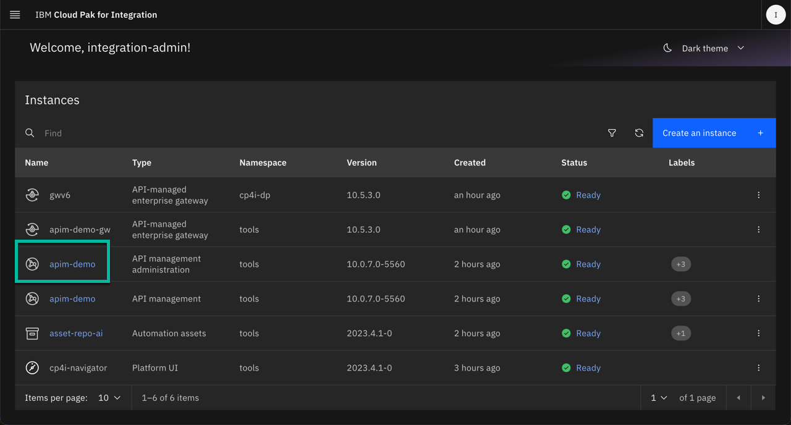
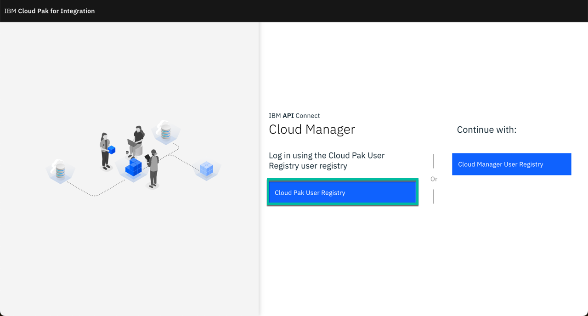
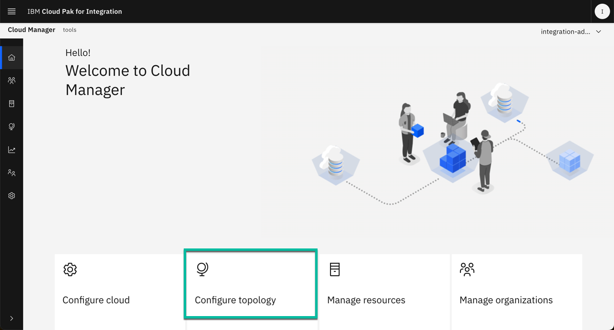
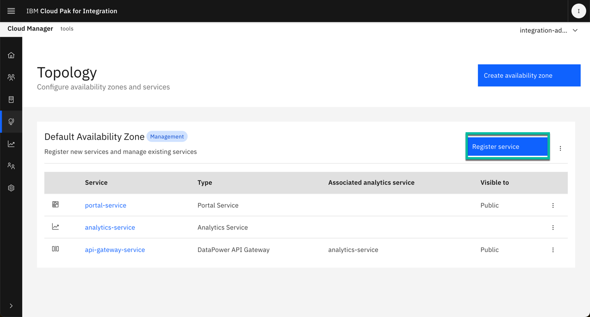
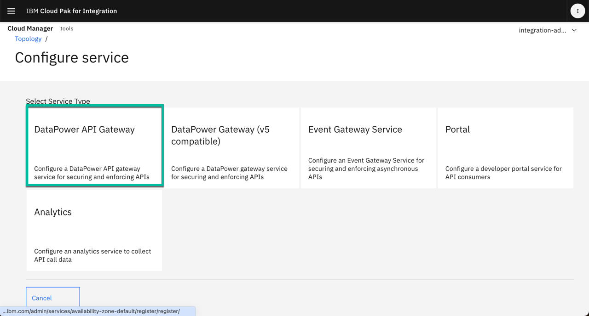
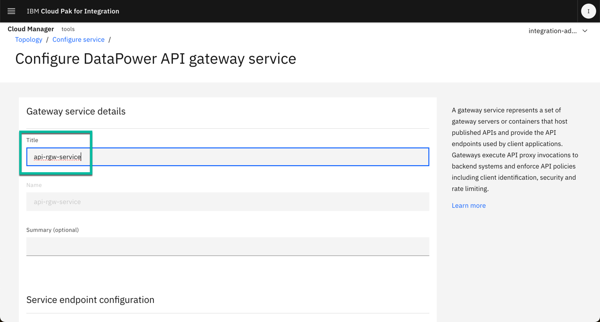
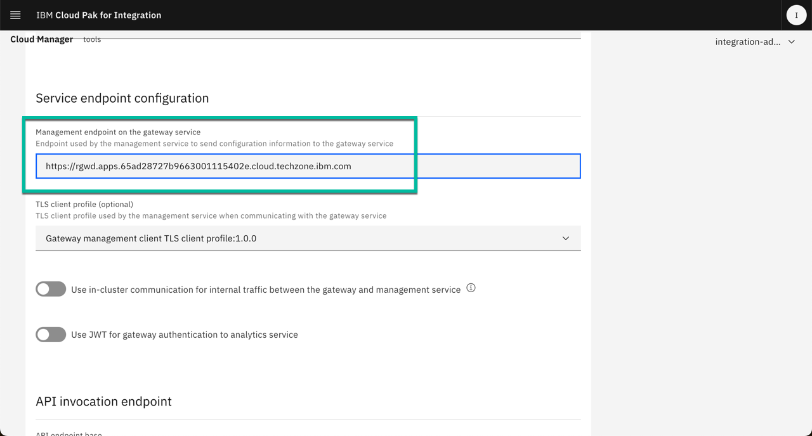
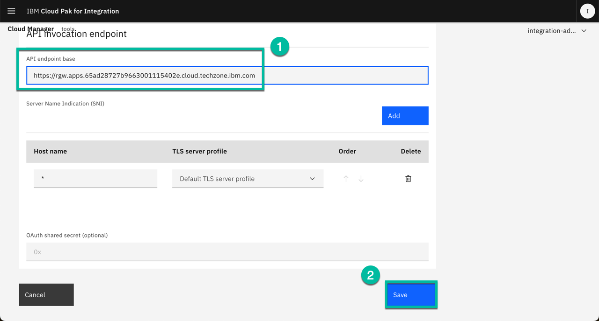
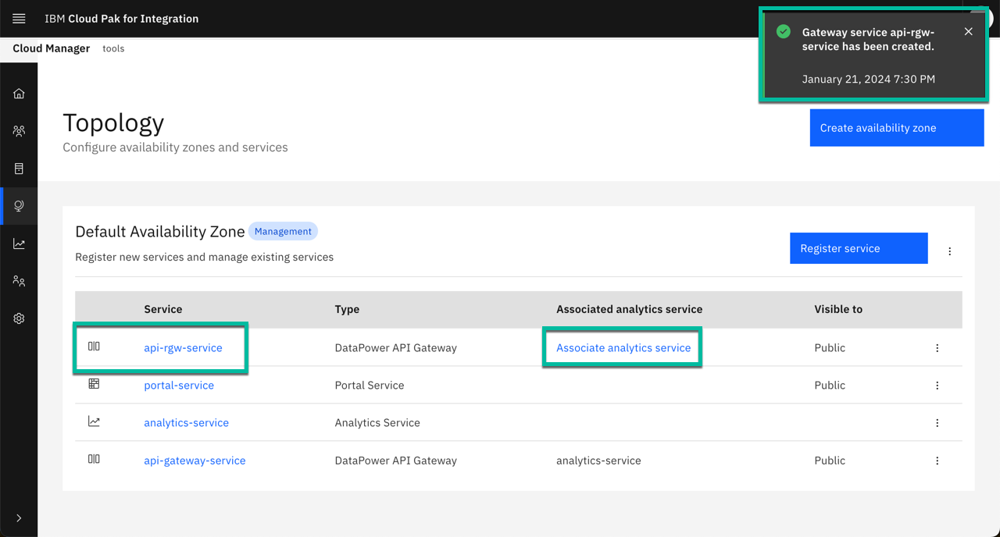

---
hide:
    - toc
---

# Deploy APIC

## Install Mail Server (mailpit):

As part of API Management, the tooling sends different personae notifications.  Using this simple Mail Server, allows this to happen as part of a Pilot or Demo environment.

Create namespace:

```bash
      oc new-project mailpit
```

Deploy Mail Server:

```bash
scripts/30a-mailpit-deploy-mail-server.sh
```

Confirm the mail server has been deployed successfully before moving to the next step running the following command:
```bash
oc get deployment mailpit -n mailpit -o jsonpath='{.status.conditions[1].status}';echo
```
You should get a response like this:
```
True
```

Create Mail Server Service and Route:
```bash
oc apply -f resources/30b-mailpit-services.yaml
oc apply -f resources/30c-mailpit-route.yaml
```

Get Mail Server UI URL:
```
echo "http://"$(oc get route mailpit-ui -n mailpit -o jsonpath='{.status.ingress[0].host}')
```

Connect to Mail Server by Navigating to the URL and use the credentials to access the UI.

## Install Data Power

As part of APIC Data Power acts as the API Gateway.

1. Install DataPower Catalog Source:
   ```bash
   oc apply -f catalog-sources/${CP4I_VER}/05-datapower-catalog-source.yaml
   ```
   Confirm the catalog source has been deployed successfully before moving to the next step running the following command: 
   ```bash
   oc get catalogsources ibm-datapower-operator-catalog -n openshift-marketplace -o jsonpath='{.status.connectionState.lastObservedState}';echo
   ```
   You should get a response like this:
   ```
   READY
   ```
2. Install DataPower Operator:
   ```bash
   oc apply -f subscriptions/${CP4I_VER}/03-datapower-subscription.yaml 
   ```
   Confirm the operator has been deployed successfully before moving to the next step running the following command:
   ```bash
   SUB_NAME=$(oc get deployment datapower-operator -n openshift-operators --ignore-not-found -o jsonpath='{.metadata.labels.olm\.owner}');if [ ! -z "$SUB_NAME" ]; then oc get csv/$SUB_NAME --ignore-not-found -o jsonpath='{.status.phase}';fi;echo 
   ```
   You should get responses like these for both of them:
   ```
   Succeeded
   ```
## Install APIC Catalog Source and Operator
   
```bash
oc apply -f catalog-sources/${CP4I_VER}/07-api-connect-catalog-source.yaml
```
   
Confirm the catalog source has been deployed successfully before moving to the next step running the following command: 
```bash
oc get catalogsources ibm-apiconnect-catalog -n openshift-marketplace -o jsonpath='{.status.connectionState.lastObservedState}';echo
```
You should get a response like this:
```
READY
```

Install APIC Operator:
```bash
oc apply -f subscriptions/${CP4I_VER}/04-api-connect-subscription.yaml 
```

Confirm the operator has been deployed successfully before moving to the next step running the following command:
```bash
SUB_NAME=$(oc get deployment ibm-apiconnect -n openshift-operators --ignore-not-found -o jsonpath='{.metadata.labels.olm\.owner}');if [ ! -z "$SUB_NAME" ]; then oc get csv/$SUB_NAME --ignore-not-found -o jsonpath='{.status.phase}';fi;echo   
```

You should get responses like these for both of them:
```
Succeeded
```

## Deploy APIC

Deploy APIC instance with some extra features enabled:

```bash
scripts/07d-apic-inst-deploy-instana.sh
```

Confirm the installation completed successfully before moving to the next step running the following commands:
```bash
oc get APIConnectCluster apim-demo -n tools -o jsonpath='{.status.phase}';echo
```
Note this will take almost 30 minutes, so be patient, and at the end you should get a response like this:
```
Ready
```

## APIC Optional Configuration Steps

### Configure APIC integration with Instana (optional):
```bash
scripts/07e-apic-instana-config.sh
```

Configure the email server in APIC:
```bash
scripts/07f-apic-initial-config.sh
```

Create a Provider Organization for admin user:
```bash
scripts/07g-apic-new-porg-cs.sh
```

Create a Provider Organization for user in local registry (optional):
   1. Set environment variables:
      ```
      export USER_NAME=<your-user-name>
      export USER_EMAIL=<your-email-address>
      export USER_FNAME=<your-first-name>
      export USER_LNAME=<your-last-name>
      export USER_PWD=<your-personal-password>
      ```
   2. Create Provide Organization:
      ```
      scripts/07h-apic-new-porg-lur.sh
      ```

Set API Key for post deployment configuration:
      1. Get API Key following instructions listed [here](https://www.ibm.com/docs/en/api-connect/10.0.x?topic=applications-managing-platform-rest-api-keys#taskcapim_mng_apikeys__steps__1){target="_blank"}
      2. Set environment variable for API Key:
         ```
         export APIC_API_KEY=<my-apic-api-key>
         ```
Create secret for Assemblies (optional):
```bash
scripts/07i-apic-secret-cp4i-alt.sh
```
Deploy extra API Gateway (optional):
```bash
scripts/07j-apic-extra-gw-deploy.sh
```
Confirm the instance has been deployed successfully before moving to the next step running the following command:
```bash
oc get gatewaycluster remote-api-gw -n cp4i-dp -o jsonpath='{.status.phase}';echo
```
You should get responses like these:
```
Running
```

Enable WebUI for extra API Gateway (optional):
      1. Attach to the API Gateway pod:
         ```
         oc attach -it gwv6-0 -n cp4i-dp
         ```
      2. Enter credentials to log into the virtiual appliance:
         ```
         user: admin
         password: admin
         ```
      3. Enter `config` when you see "idg#"
      4. Enter `web-mgmt` when you see "idg(config)#"
      5. Enter `admin-state enabled` when you see "idg(config web-mgmt)#"
      6. Enter `exit`
      7. Enter `write mem` when you see "idg(config)#"
      8. Enter `top` when you see "idg(config)#"
      9. Enter `exit` when you see "idg#"
      10. Get the DP Gateway Web UI URL:
         ```
         echo "https://"$(oc get route dpwebui-route -n cp4i-dp -o jsonpath='{.spec.host}')
         ```
      11. Go to your favorite browser and enter the URL.
         *Note*: This is ONLY for demo purposes and show the Web UI but you shouldn't be making changes to a DP Gateway running on containers via the Web UI.

Post extra gateway deploy configuration (optional):
      1. Get the required info:
         ```bash
         scripts/07g-apic-extra-dp-info.sh
         ```
      2. Navigate to the APIC CMC clicking on the instance name as shown below: 
         
      3. Select the `Cloud Pak User Registry` as shown below:
         
      4. Click on the `Configure Topology` tile as shown below:
         
      5. Click the `Register Service` button as shown below:
         
      6. Select the `DataPower API Gateway` tile as shown below:
         
      7. Type the name of the service in the `Title` box, for instance "api-rgw-service" as shown below:
         
      8. Scroll dowm and paste the `Management Endpoint URL` you got from the first step under the "Service endpoint configuration" section as shown below:
         
      9. Scroll down and paste the `API Endpoint Base URL` you got from the first step under the "API invocation endpoint" section and click the `Save` button as shown below:
         
      10. The screen shows the new API Gateway Service in the Topology as shown below:
         
         Note you can associate the new API Gateway with the Analytics Service on your own if needed.

