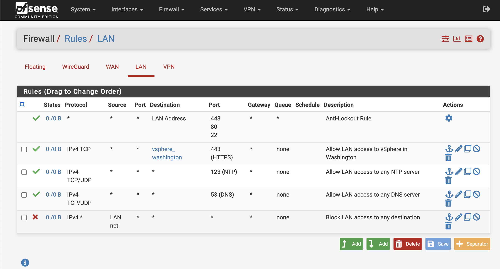

The aliases and firewall rules for this exercise are available in the Box folder. When prompted to select a file in the steps below, choose the file with the name that matches the data center of your environment.

1. Validate that the bastion can currently access the internet.

    ```
    ping ibm.com
    ```

    The result will show that the bastion server can access the host.

    ``` {.text .no-copy title="Example output"}
    [admin@bastion ~]$ ping ibm.com
    PING ibm.com (104.69.122.4) 56(84) bytes of data.
    64 bytes from a104-69-122-4.deploy.static.akamaitechnologies.com (104.69.122.4): icmp_seq=1 ttl=52 time=1.69 ms
    64 bytes from a104-69-122-4.deploy.static.akamaitechnologies.com (104.69.122.4): icmp_seq=2 ttl=52 time=1.91 ms
    64 bytes from a104-69-122-4.deploy.static.akamaitechnologies.com (104.69.122.4): icmp_seq=3 ttl=52 time=1.85 ms
    ```


1. Open a browser and navigate to https://pfsense.gym.lan{: target="_blank" .external }.

    Login as user `admin` with the password from the "Shared Reservation" section of your reservation.

1. Load the aliases and firewall rules.

    1. Navigate to **Diagnostics > Backup & Restore**.
    
    1. In the Restore Backup section select **Aliases** from the **Restore area** drop-down box
    
    1. Click the button **Choose file** in the Configuration file field
    
    1. Select the file and click **Open**
    
    1. Click **Restore Configuration** and confirm by clicking **OK**
    
    1. In the Restore Backup section select **Firewall Rules** from the **Restore area** drop-down box
    
    1. Click the button **Choose file** in the Configuration file field
    
    1. Select the file and click **Open**
    
    1. Click **Restore Configuration** and confirm by clicking **OK**

        Note that it is not necessary to reboot pfsense.

1. Check the firewall rules.

    1. Navigate to **Firewall** > **Rules**

    1. Click the **LAN** tab

        <figure markdown="span">
            <figcaption>Reference Firewall Rules for pfsense</figcaption>
            
        </figure>

1. Validate that the bastion can no longer access the internet.

    ```
    ping -w 10 ibm.com
    ```

    The result will show that the bastion server can access the host.
    
    ``` {.text .no-copy title="Example output"}
    [admin@bastion ~]$ ping -w 10 ibm.com
    PING ibm.com (104.69.122.4) 56(84) bytes of data.

    --- ibm.com ping statistics ---
    10 packets transmitted, 0 received, 100% packet loss, time 9245ms
    
    ```
