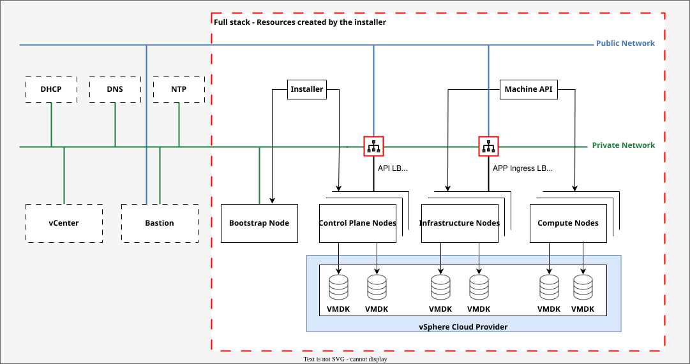
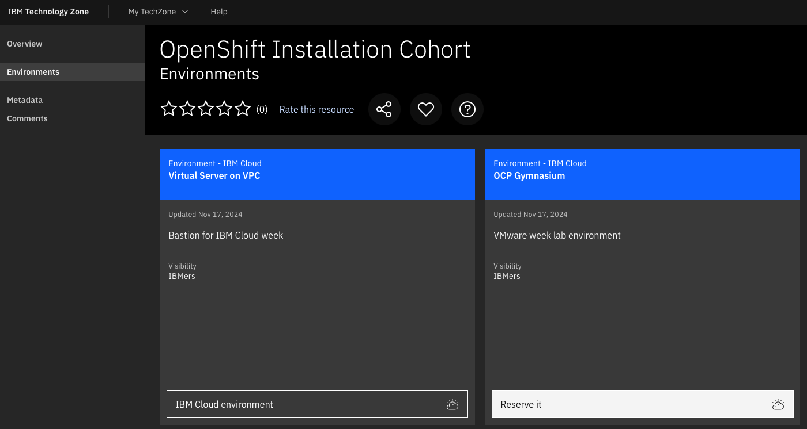
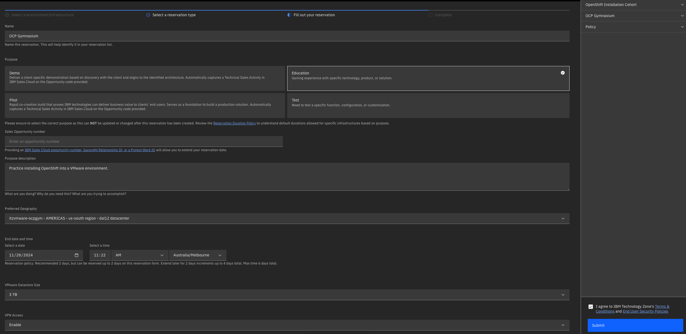
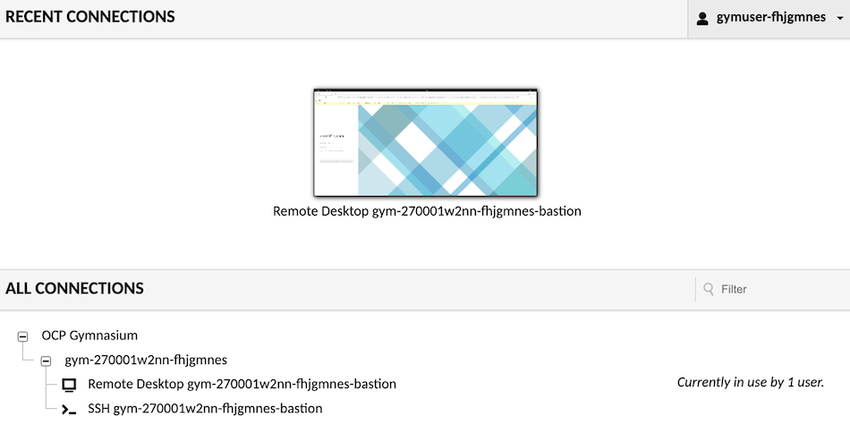

# Deploying OpenShift on VMware

In this exercise, you will learn how to deploy an OpenShift cluster on a VMware virtualized environment using Installer Provisioned Infrastructure (IPI), also known as full-stack automation. By the end, you will have gained hands-on experience in installing and configuring an OpenShift cluster ready for IBM Client Engineering Pilots.

## Outcomes

Upon completion of this exercise, you will be able to:

- **Install OpenShift on vSphere** : Deploy an OpenShift cluster using IPI, which automates the installation process from scratch.
- **Configure Identity Provider for htpasswd Authentication** : Set up identity provider authentication for your OpenShift cluster using htpasswd.
- **Install Red Hat OpenShift Data Foundation (ODF)** : Deploy ODF, a software-defined storage solution that supports both read-write many (RWX) and read-write once (RWO) storage classes.
- **Configure ODF Storage for Internal Image Registry** : Configure ODF to provide persistent storage for your internal image registry.

## Scenario

A modernization project requires containerizing existing applications using OpenShift, but the client lacks the necessary human resources to build the cluster. As part of our IBM team, you have been tasked with constructing an OpenShift cluster on their behalf.

The required cluster configuration consists of eight nodes:

| Node type	     | vCPU | Memory in GiB | Disk size in GB |
| :------------- | :--: | :-----------: | :-------------: |
| Control Plane  | 4 | 16 | 120 |
| Compute        | 8 | 16 | 120 |
| Infrastructure | 16 | 64 | 120 |

In addition, you will need to deploy a software-defined storage (SDS) solution that meets the following requirements:

- Supports both RWX and RWO storage classes
- Meets the specifications outlined above

We have chosen Red Hat OpenShift Data Foundation (ODF) as our SDS solution. ODF is a highly scalable and flexible storage platform that supports various use cases, including persistent storage for applications and internal image registries.

For reference purposes, please recall the illustration of the IPI installation process on vSphere from DO322:

{target="_blank"}

## Provision the lab environment

1. Navigate to the [OpenShift Installation Cohort](https://techzone.ibm.com/collection/openshift-installation-cohort){target="_blank"} collection in TechZone.

2. On the left hand side click **Environments** and then click the **Reserve it** button on the **OCP Gymnasium** tile.
    
    {target="_blank"}

3. Select **Reserve now**.

4. Fill out the reservation form adding your information where relevant (use the screenshot below for guidance).
    
    {target="_blank"}

5. Click **Submit**. Provisioning approximately takes 30 minutes.

6. Once your environment has been provisioned you will receive an e-mail from noreply@techzone.ibm.com with your reservation details.  Open your reservation details by clicking the URL under Reservation ID.

    1. If you want to use Guacamole, click the **Open your IBM Cloud environment** button.  Expand the **ALL CONNECTIONS** section and test to make sure you can open the Remote Desktop and SSH sessions. If both are working your environment has been provisioned and is ready for install.
        {target="_blank"}

    2. If you want to use WireGuard click the **Download WireGuard VPN** config button and use that configuration file to start the VPN tunnel. The bastion's IP address is `192.168.252.2`, the username is `admin` and the password is at the top of your reservation.

!!! Information "DNS and WireGuard on MacOS"
    The DNS server (192.168.253.1) configured in the WireGuard client might not be queried. The Cisco Secure Client enables the DNS Proxy and Transparent Proxy by default. Disabling the proxies is a work around, when you disable them they enable themselves automatically. It might take up to 10 tries to get them in the desired state, disabled.
