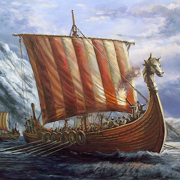

# Use Cases

## Use Cases for Your Pattern Technology Pattern

Some short statement providing a little context ...

-   __Use Case 1__

    ---

    { width="50%" align=right}

    Short description of use case one including names of products involved.  This picture is squre and simply sized to half of the card.  You can have a dark and light version.

    `APIC` `ACE` `StepGen GraphSQL` `Noname Security`

    [:octicons-arrow-right-24: Show me more ...](use-case-one/index.md)

-   __Use Case Two__

    ---

    { width="50%" align=right}

    Short description of use case two including names of products involved.  This picture is squre and simply sized to half of the card.  You can have a dark and light version.

    `APIC` `ACE` `StepGen GraphSQL` `Noname Security`

    [:octicons-arrow-right-24: Show me the use case ...](use-case-two/index.md)

-   __Use Case Three__

    ---

    { width="50%" align=right}

    Short description of use case three including names of products involved. Skol!

    `APIC` `ACE` `StepGen GraphSQL` `Noname Security`

    [:octicons-arrow-right-24: Take me to the solution ...](use-case-three/index.md)

-   __Use Case Four__

    ---

    { width="50%" align=right}

    Short description of use case that doesn't actually exist but just wanted balance.

    `APIC` `ACE` `StepGen GraphSQL` `Noname Security`

    [:octicons-arrow-right-24: Show me more ...](use-case-three/index.md)

