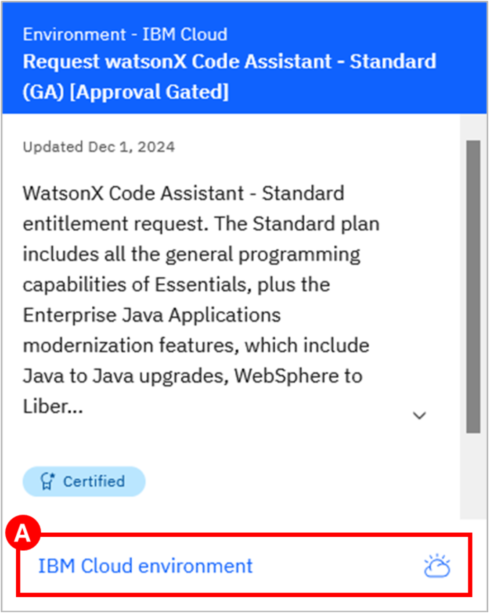
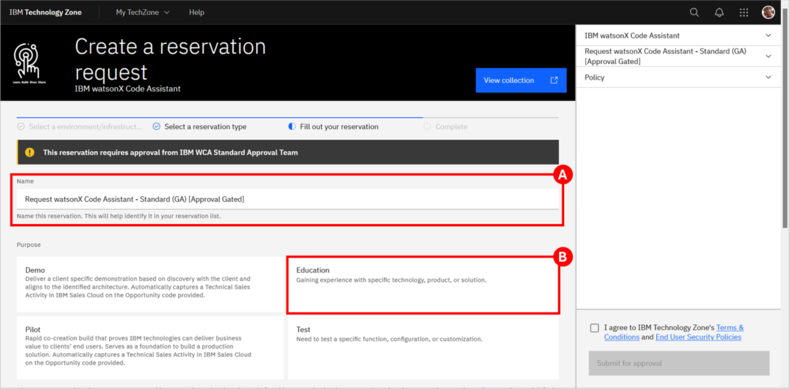
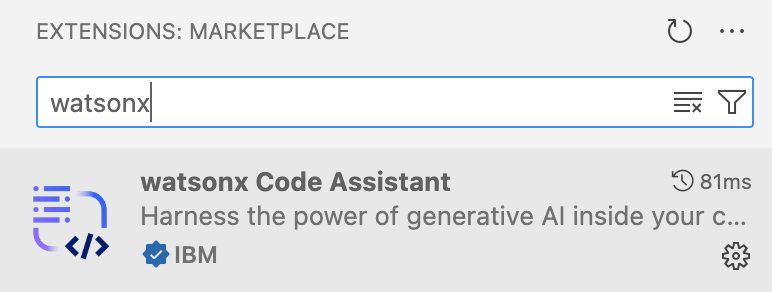
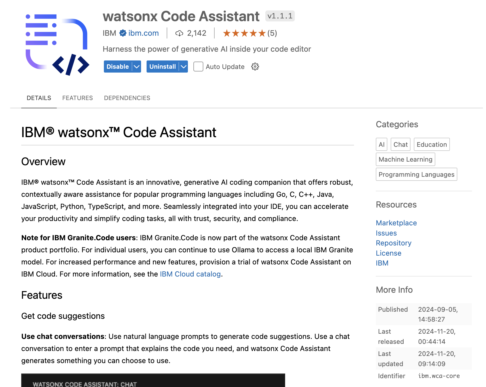
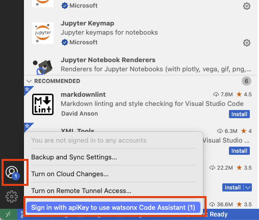
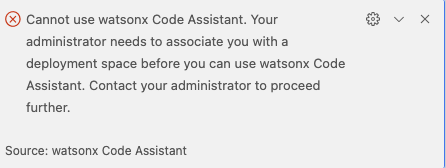
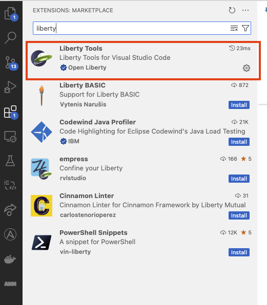
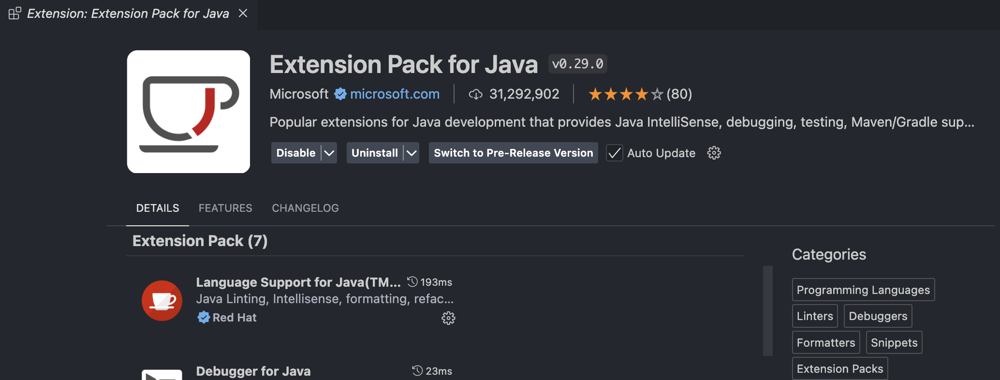
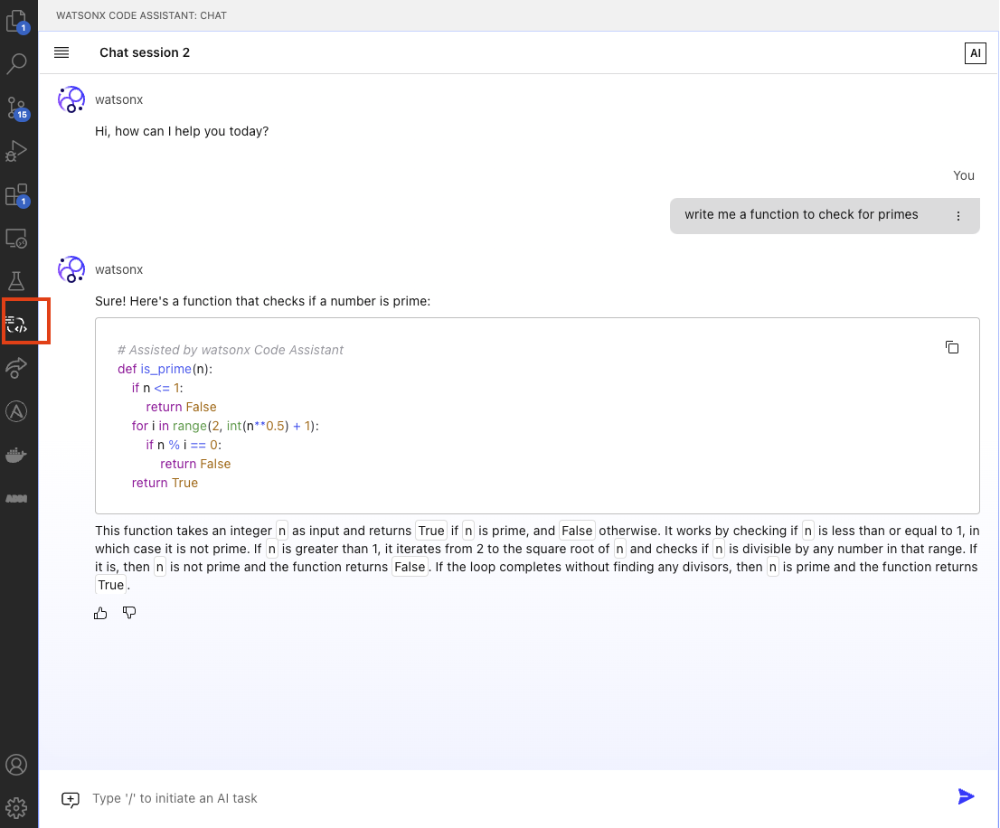

---
Title: App Development & Modernization with WCA
hide:
    - toc
---

# App Development & Modernization with WCA

The main objective of this lab is to provide hands-on experience with some of the core features and capabilities available to developers in IBM watsonx Code Assistant (WCA). The lab content is loosely organized to align with the capabilities found in the two different plans
(editions) available for WCA:

**Essentials:** This accelerates software development, allowing developers to use WCA with integrated generative AI for coding tasks, including:

- Generating code
- Explaining code
- Creating unit tests
- Documenting code

**Standard:** In addition to all the capabilities found in the Essentials plan, the Standard plan also includes these enterprise Java modernization capabilities:

- Java upgrades, regardless of runtime
- WebSphere to Liberty transformation
- Enhanced test generation and code explanation

After completing this lab, you will have a deeper understanding of what is possible with WCA and will have observed how it can be a powerful tool to help accelerate software development and application modernization.

## Prerequisite Installation Steps

As previously mentioned, there are two separate components that make up IBM watsonx Code Assistant (WCA):

- WCA service – This is the back-end software, leveraging generative AI, that services requests from developers. It is available as software-as-a-service (SaaS) on IBM Cloud and as deployable software for on-premises and cloud deployments.
- WCA extension (also referred to as a plug-in) – Installed in an integrated development environment (IDE) on a developer’s own system, this is how the developer interacts with WCA. It includes a chat interface as well as in-source options for generating, explaining, and documenting code. It can also help drive Java upgrades and WebSphere to Liberty transformation, among other things. The IDEs currently supported by WCA are Visual Studio Code (VS Code) and Eclipse.

!!! Tip
    To avoid the need for you to setup your own development environment (which would include installation of an IDE, the WCA extension, various other software, and sample source code), a pre-configured environment has been made available for you in IBM Technology Zone (TechZone).  Likewise, a WCA service has been made available to you as well, also available through TechZone.  **However**, this lab assists you in setting up your own system to perform the lab on your own system using the TechZone WCA Service as the back-end.

### Reserve the TechZone Environment

Open the collection for [WCA-related environments in TechZone](https://techzone.ibm.com/collection/wca/environments){target=_blank}. Sign in with your IBMid if prompted.

Locate the Request **watsonX Code Assistant - Standard (GA) [Approval Gated]** tile and click the IBM Cloud environment / Reserve it button (A).   There are multiple tiles listed, some of which have a similar name – ensure you’re selecting the correct one.

{width=35%}

Accept the default for the reservation Name (A) or provide a name of your choosing. For the Purpose of the reservation, select Education (B).

{width=75%}

- Fill in the Purpose description box with the reason you are making the reservation. Then, select your Preferred Geography based on your desired location.
- Adjust the reservation’s Start date and time and End date and time as needed (note that you can extend your reservation later if you need more time).
- In the lower-right corner, follow the links to read TechZone’s terms, conditions, and security policies, and then select the checkbox to agree to them.
- Click Submit for approval.  
- A message in the upper-right corner will briefly appear stating that the reservation has been created.


!!! Note
    You will receive an email from IBM Technology Zone with a subject of “Request is Pending Approval”. Once it has been approved you will receive another email with a subject of “Request Approved”.
    
    When provisioning starts (based on the start time you provided) an email with a subject of “Reservation Provisioning on IBM Technology Zone” is sent. Finally, an email with a subject of “Reservation Ready on IBM Technology Zone” indicates that provisioning has completed.

While waiting for this reservation to be provisioned, continue on to the next section to request the second
environment you’ll need.

!!! Tip "If you want a developer system from TechZone
    If you chose not to use your local system as your development environment follow the below steps.

    The pre-configured development demonstration environment, which includes the following software and sample data:
    - Red Hat Enterprise Linux 9
    - Visual Studio Code (VS Code) (including the WCA extensions)
    - Eclipse IDE for Java Developers
    - OpenJDK 11 & 21
    - Sample ModResorts application
    
    Follow the steps below to provision your WCA development demonstration environment from TechZone.
    
    - Open the collection of [WCA-related environments in TechZone](https://techzone.ibm.com/collection/wca/environments){target="_blank"}. Sign in with your IBMid if prompted.
    - Locate the watsonx Code Assistant - Demonstration VM tile and click the IBM Cloud environment / Reserve it button.  Note: There are multiple tiles listed, some of which have a similar name – ensure you’re selecting the correct one.
    
    For the reservation type, select the Reserve now radio button.
    
    Accept the default for the reservation Name or provide a name of your choosing. For the Purpose of the reservation, select Education.
    
    Fill in the Purpose description box with the reason you are making the reservation. Then, select your Preferred Geography based on your desired location. 
    
    Adjust the reservation’s End date and time as needed (note that you can extend your reservation later if you need more time). Leave VPN Access as Disable.
    
    In the lower-right corner, follow the links to read TechZone’s terms, conditions, and security policies, and then select the checkbox to agree to them. Finally, click Submit.
    
    A message in the upper-right corner will briefly appear stating that the reservation has been created.  First, you will receive an email from IBM Technology Zone with a subject of “Reservation Provisioning on IBM Technology Zone”. Once it has been provisioned, an email with a subject of “Reservation Ready on IBM Technology Zone” is sent.

## Workstation Setup

### Java installation

Install Java21 using the applicable link:

- [Download Java for MacOS - Arm64](https://download.oracle.com/java/21/latest/jdk-21_macos-aarch64_bin.tar.gz)
- [Download Java for MacOS - x86](https://download.oracle.com/java/21/latest/jdk-21_macos-x64_bin.tar.gz)
- [Download Java for Windows](https://download.oracle.com/java/21/latest/jdk-21_windows-x64_bin.zip)

All the above are compressed files, you can extract them to any folder in your local.

Check if Java is installed properly:
```bash
java --version
```

After installing java, add java to `PATH` variable and set `JAVA_HOME` envitonment variable

=== "For Mac"
    Open .zshrc or .bash_profile
    
    ```bash
    nano ~/.zshrc
    ```
    
    Add the following lines
    
    ```bash
    export JAVA_HOME=/Library/Java/JavaVirtualMachines/<java version>/Contents/Home
    ```

    ```bash
    export PATH=$JAVA_HOME/bin:$PATH
    ```
    
    Save the file and exit (press CTRL + X, then Y, and hit Enter) and reload the shell configuration so the changes take effect.
    
    ```bash
    source ~/.zshrc
    ```
    
    Verify the JAVA_HOME with the following command:
    
    ```bash
    echo $JAVA_HOME
    ```

=== "For Windows"
    Open Environment variables using windows search bar (search for edit environment variables in the search bar)
    
    

    Set JAVA_HOME variable using Environment variables (click on new if you do not have a JAVA_HOME set or click on edit to change the existing JAVA_HOME, and point it to the Java you installed in the earlier steps:
      
    

    ```bash
    JAVA_HOME= C:\Program Files\Java\jdk-21
    ```
      
    Add Java to PATH using Environment variables:
  
    
  
    ```bash
    %JAVA_HOME%\bin
    ```


### 2. Install Maven

=== "For Mac"
    
    Install maven using homebrew
    ```bash
    brew install maven
    ```
    
    Check if maven is installed properly:
    
    ```bash
    mvn --version
    ```

=== "For Windows"
    Visit the official Maven website: [Maven Download Page](https://maven.apache.org/download.cgi){target="_blank"}
    
    Under "Files", click on the binary zip archive link (e.g., apache-maven-x.x.x-bin.zip). 
    
    Extract the zip file to a location of your choice, e.g., C:\Apache\maven.
    
    Set MAVEN_HOME variable using Environment variables:
    ```bash
    MAVEN_HOME= <path-to-folder>\maven\apache-maven-3.9.9-bin\apache-maven-3.9.9
    ```
    
    Add Maven to PATH using Environment variables: 
    ```bash
    <path-to-folder>\maven\apache-maven-3.9.9-bin\apache-maven-3.9.9\bin
    ```


### 3. Install VSCode

[VSCode Official Website](https://code.visualstudio.com/download){target="_blank"} for installation

### 4. WCA4EJ API Key

XXXXXX Need instructions for getting from Gated env on TZ XXXXXXXX

### 5. Download WCA4EJ Extension

Download watsonx Code Assistant extension from Marketplace

{width=50%}

Click Install.

Then you will see the product page.



### 6. Log in to the WCA


#### After installing the extension from **Step 5**, login into the extension via following steps:

- Login with WCA4EJ API Key at the bottom left corner of VSCode. After successfully signed in, the number indicator should be gone.



- If you encoutner issue during autherization that says **"administrator needs to associate you with a deployment space"**, please reach out to IBMers to setup deployment space again for your API Key. 




### 7. Installing Liberty Tools and Java Extension

Install the Liberty Tools and extension Pack for Java extensions from VSCode marketplace as shown below.





### 8. Start Using WCA4EJ

You can check by navigating to the **watsonx Code Assistant** tab if your API Key is setup correctly by opening the chat window of WCA4EJ and chat with the model.


